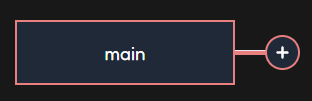
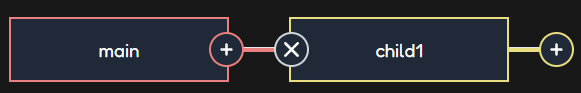
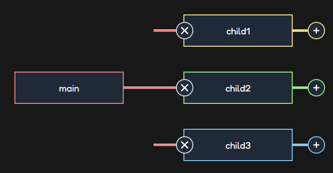

This project is the result of a technical test, it consists in a horizontal mindmap.

# Project

You start with the main bloc. When the parent doesn't have any child the button appears slightly detached on the right.  

 
  
When you add a child by clicking the + button, the new component has a predefined color and title based on its index.   
The color of the links between the parent and the children is based on the parent's color.  
You can change the title of any block.  
You can delete a child by clicking the x button. It will also delete all his children and so on.

 
  
When you reach the limit of 3 children the + button disappears.    

 


# Local Setup

```sh
$ npm install
$ npm run dev
```